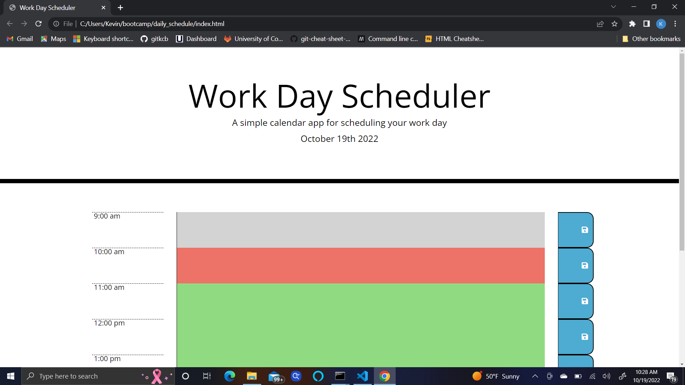

# Daily Schedule
https://gitkcb.github.io/daily_schedule/
## Description
This website was created to allow the user to plan their day using a electronic planner that has time slots for the work week of 9am-5pm. this planner will save your daily schedule in local storage so the page can be refreshed and your plans will be saved. This project was built to make planning more convenient. I learned how to use Bootstrap and Jquery and moment.js. 
Provide a short description explaining the what, why, and how of your project. Use the following questions as a guide:

## Usage
The user clicks the timeframe they want to schedule something then hit the button to the right of the text box to save their plans. The scheduele is color coded for time in the future (green), present time (red), and past time (gray). This feature helps the user organize their time better. the user can refresh their page and their plans will still be on the page as needed. 

.png)
.png)

## Credits

Referenced https://github.com/chenallee/moment.js-day-scheduler for assistance

